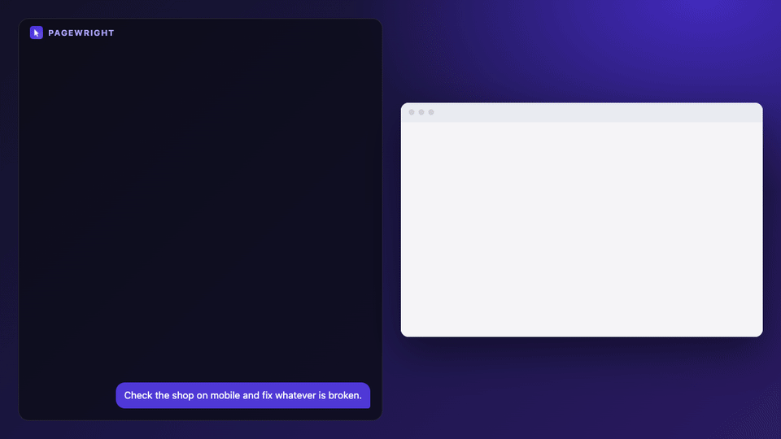
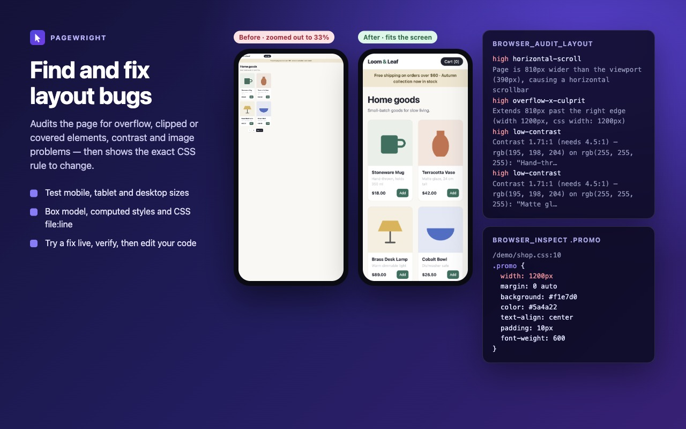
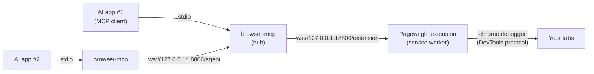

<div align="center">


# Pagewright

**Give your AI agent a real browser.**
An MCP server and Chrome extension that let Claude, Cursor and any MCP client see and control the browser you already use, with your logins, to test and fix frontends and to scrape data.

[](https://github.com/zamansheikh/browser-mcp/actions/workflows/ci.yml)
[](LICENSE)
[](https://modelcontextprotocol.io)
[](https://nodejs.org)
[](CONTRIBUTING.md)

[Quick start](#quick-start) · [What it can do](#what-it-can-do) · [Tool reference](docs/TOOLS.md) · [How it works](#how-it-works) · [Contributing](#contributing)



<sub>A real session: every line on the left is actual tool output from Pagewright.</sub>

</div>

## Why Pagewright

Most browser tools for AI agents start a fresh, empty browser. Pagewright works in **your** browser instead.

- **Logged in already.** Your sessions and cookies are there, so agents can work on dashboards, admin panels and sites behind a login.
- **Built for fixing frontends.** `browser_audit_layout` finds overflow, overlapping elements, clipped text, contrast and image problems. `browser_inspect` shows the CSS rule behind a style, with its file and line number, so the agent knows exactly what to edit.
- **Scraping that holds up.** Pagewright extracts records, follows pagination and infinite scroll, and saves to CSV or JSON. It can also read the JSON APIs a page calls.
- **Real input.** Clicks and keystrokes go through Chrome's DevTools protocol, so they work with React, Vue and Svelte. If a modal covers the target, the click fails and says so, instead of hitting the wrong element.
- **Compact page snapshots.** A tree of headings, text and controls, each control with a `[ref=e12]` handle. It is cheaper and more precise than sending screenshots.
- **Several agents, one browser.** Every agent session shares the same browser through a local hub, with automatic failover.
- **Local only.** Everything stays on `127.0.0.1`: no cloud, no telemetry. Web pages cannot connect to the server.

## Quick start

You need [Node.js 18+](https://nodejs.org), [git](https://git-scm.com), and Chrome, Brave, Edge or another Chromium browser.

**1. Install the server.** One command, which also registers it with Claude Code if you have it:

```bash
npx -y github:zamansheikh/browser-mcp setup
```

**2. Add the extension.** Open `chrome://extensions`, turn on **Developer mode**, click **Load unpacked**, and choose `~/.browser-mcp/extension`. The installer prints this path and opens the folder for you. A Chrome Web Store listing is in review.

**3. Check it works:**

```bash
npx -y github:zamansheikh/browser-mcp check
```

Restart your AI app (MCP servers load at startup) and ask it to *"open example.com and describe the page"*.

<details>
<summary><b>Other AI apps</b> (Claude Desktop, Cursor, Windsurf, VS Code, Codex…)</summary>

`setup` prints the exact command and paths for your machine. The config looks like this in most apps:

```json
{
  "mcpServers": {
    "browser": {
      "command": "node",
      "args": ["/Users/you/.browser-mcp/server/index.js"]
    }
  }
}
```

| App | Where the config goes |
|---|---|
| Claude Code | `claude mcp add browser -s user -- node ~/.browser-mcp/server/index.js` |
| Claude Desktop | `~/Library/Application Support/Claude/claude_desktop_config.json` (macOS), `%APPDATA%\Claude\claude_desktop_config.json` (Windows) |
| Cursor | `~/.cursor/mcp.json` |
| Windsurf | `~/.codeium/windsurf/mcp_config.json` |
| VS Code | `.vscode/mcp.json`, under a `"servers"` key |

</details>

<details>
<summary><b>Install from a clone</b> (for development)</summary>

```bash
git clone https://github.com/zamansheikh/browser-mcp
cd browser-mcp
npm install
```

Load the `extension/` folder with **Load unpacked**, then point your AI app at `node /absolute/path/to/browser-mcp/server/index.js`.

</details>

## What it can do

### Test and fix a frontend

> *"Open localhost:3000, check it on mobile, tablet and desktop, and fix any layout problems in the source."*



The agent sets the viewport (`browser_set_viewport`) and runs `browser_audit_layout`, which reports:

- horizontal overflow and **the element that causes it**
- content spilling out of its container, and text that is cut off
- elements covered by others, so clicks would land on the wrong thing
- broken, stretched or oversized images
- low color contrast, tiny text and tap targets, and unlabeled buttons
- console errors and failed network requests

It then runs `browser_inspect` on a culprit to get the box model, computed styles, and **the matching CSS rules with file:line**. It tests a fix live with `browser_inject_css`, confirms it with a screenshot and a second audit, and edits your source.

### Scrape structured data

> *"Collect every product from this category, following the Next button, into products.csv with name, price and link."*

```jsonc
// browser_scrape
{
  "url": "https://shop.example.com/category/lamps",
  "itemSelector": ".product-card",
  "fields": {
    "name": "h2",
    "price": { "selector": ".price", "type": "number" },
    "url": "a@href",
    "tags": { "selector": ".tag", "all": true }
  },
  "nextSelector": "a[rel=next]",
  "maxPages": 20,
  "savePath": "products.csv"
}
```

Field specs can be `"selector"`, `"selector@attribute"`, `"."` (the item itself), or `{ selector, attr, all, type: "number", regex }`. Use `infiniteScroll: 10` for feeds. `browser_get_content` turns any page into markdown, links, tables or metadata (including JSON-LD). `browser_network` with `browser_network_body` reads the JSON APIs a page calls, which is often cleaner than parsing HTML.

Please scrape responsibly: follow sites' terms, and keep `delayMs` polite.

### Automate and test flows

> *"Log in to the staging dashboard, create a test invoice, and tell me if anything errors in the console."*

```
- form "Sign in":
  - textbox "Email" [type=email] [value=""] [ref=e9]
  - textbox "Password" [type=password] [value=""] [ref=e10]
  - button "Sign in" [ref=e12]
```

The agent reads a snapshot like the one above, then clicks and types by ref: `browser_click { ref: "e12" }`. Refs last until the element is removed or the page navigates.

## Tools

| Area | Tools |
|---|---|
| Tabs and navigation | `browser_status` · `browser_tabs` · `browser_navigate` |
| Seeing the page | `browser_snapshot` · `browser_screenshot` · `browser_get_content` |
| Interacting | `browser_click` · `browser_type` · `browser_press_key` · `browser_select_option` · `browser_hover` · `browser_scroll` · `browser_wait_for` · `browser_upload_file` · `browser_handle_dialogs` · `browser_evaluate` |
| Frontend debugging | `browser_audit_layout` · `browser_inspect` · `browser_set_viewport` · `browser_inject_css` · `browser_console` · `browser_network` · `browser_network_body` |
| Scraping | `browser_extract` · `browser_scrape` |

**[Full reference with every parameter →](docs/TOOLS.md)**. It is generated from the code, so it is always current.

## How it works



1. Your AI app starts `browser-mcp` as an MCP server over stdio.
2. The first `browser-mcp` process becomes the **hub** on `127.0.0.1:18800`. Later ones relay through it, and one takes over if the hub exits.
3. The **extension** connects to the hub and runs each command in the browser: DevTools-protocol calls for input, screenshots, emulation, CSS, console and network, plus a small in-page library ([`page-lib.js`](extension/page-lib.js)) for snapshots, audits and extraction.
4. If Pagewright is installed in more than one browser, the first to connect is active and the others wait on standby.

## Configuration

| Variable | Default | Purpose |
|---|---|---|
| `BROWSER_MCP_PORT` | `18800` | Hub port. Must match the port in the extension popup. |
| `BROWSER_MCP_CONNECT_TIMEOUT` | `20000` | Milliseconds a call waits for the extension to connect. |
| `BROWSER_MCP_EXTENSION_IDS` | any | Comma-separated extension IDs allowed to connect. |

## Security and privacy

Pagewright gives an AI agent the same power you have in your browser, including on sites where you are logged in. Connect only agents you trust.

- The hub listens only on `127.0.0.1`. The `/extension` endpoint accepts only browser-extension origins, and `/agent` rejects any request that carries an `Origin` header, so websites cannot drive your browser.
- Chrome shows a "started debugging this browser" bar on every tab under control. Release tabs from the popup at any time.
- There is no telemetry, and there are no accounts. See the [privacy policy](PRIVACY.md).
- JavaScript `alert`/`confirm` dialogs are auto-accepted so pages don't freeze the agent. Each one is logged, and `browser_handle_dialogs` changes this.

Found a vulnerability? Please report it privately, as described in [SECURITY.md](SECURITY.md).

## FAQ and troubleshooting

<details>
<summary><b>The agent says the extension is not connected</b></summary>

Check that the browser is open and Pagewright is enabled. The popup should show the same port as the server (18800 by default). Then run `npx -y github:zamansheikh/browser-mcp check`. After the server starts, the extension can take up to 30 seconds to reconnect; opening the popup makes it reconnect immediately.

</details>

<details>
<summary><b>"Can't control chrome://…" or "Another debugger is already attached"</b></summary>

Chrome does not allow extensions to control its own pages (`chrome://`, the Web Store, other extensions). Navigate to a normal web page first. If DevTools is open on that tab, close it and retry.

</details>

<details>
<summary><b>Why does the browser show a "debugging" bar?</b></summary>

Pagewright uses Chrome's DevTools protocol to send trusted clicks, take screenshots and read CSS rules. Chrome always shows that bar while it is in use, which is a good thing: you can always see which tabs an agent controls.

</details>

<details>
<summary><b>How is this different from Playwright or Puppeteer?</b></summary>

Those libraries launch and script their own browser, and are best for repeatable test suites. Pagewright is made for AI agents working interactively in your everyday browser. It returns agent-friendly output (compact snapshots with refs, layout audits, CSS sources) and needs no test code.

</details>

<details>
<summary><b>Does it work with Firefox or Safari?</b></summary>

Not yet. The extension relies on Chrome's `chrome.debugger` API, so it works in Chromium browsers: Chrome, Edge, Brave, Arc, Opera and Vivaldi. Firefox support would need a different backend. [Help is welcome](https://github.com/zamansheikh/browser-mcp/issues).

</details>

<details>
<summary><b>Limitations</b></summary>

- Cross-origin iframes are not included in snapshots. Same-origin iframes are.
- Screenshots bring the tab to the front, because background tabs don't render.
- Console and network capture start when an agent first touches a tab. Reload to capture a page's initial load.
- The Chrome Web Store build leaves out `browser_evaluate`, because store extensions may not run code they didn't ship with.

</details>

## Contributing

Contributions of every size are welcome: bug reports, docs, new tools, audit rules, and support for more browsers.

- Read the **[contributing guide](CONTRIBUTING.md)**. It walks through the architecture and how to add a tool, step by step.
- Pick up a [good first issue](https://github.com/zamansheikh/browser-mcp/issues?q=is%3Aissue+is%3Aopen+label%3A%22good+first+issue%22) or anything marked [help wanted](https://github.com/zamansheikh/browser-mcp/issues?q=is%3Aissue+is%3Aopen+label%3A%22help+wanted%22).
- Have an idea or a question? Open a [discussion](https://github.com/zamansheikh/browser-mcp/discussions).

```bash
git clone https://github.com/zamansheikh/browser-mcp && cd browser-mcp && npm install
npm test          # fast checks, no browser needed
npm run test:e2e  # full browser test (see CONTRIBUTING.md)
```

### Roadmap

- [ ] Chrome Web Store release (in review)
- [ ] Publish to npm for `npx pagewright`
- [ ] Save pages as PDF, and drag and drop
- [ ] Accessibility-tree snapshot mode, using Chrome's own accessibility tree
- [ ] Network request mocking and blocking for testing
- [ ] Firefox support

If you'd like to take one of these on, open an issue to discuss it first.

## License

[MIT](LICENSE) © zamansheikh and contributors.

If Pagewright saves you time, a ⭐ helps others find it.
